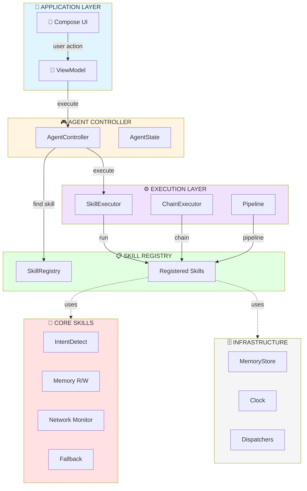
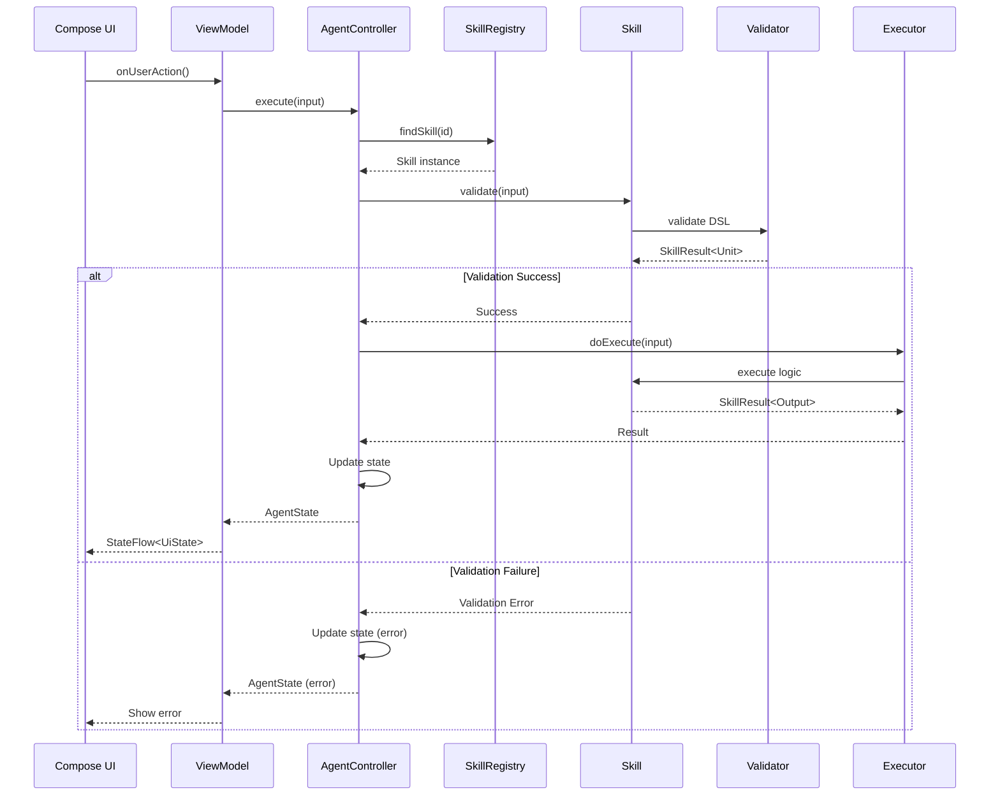
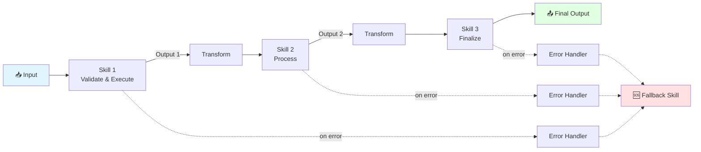

# Agent Core Module - Complete Documentation

> **Version**: 2.2.0  
> **Last Updated**: January 2026  
> **Status**: Production-Ready

## 📦 Package Structure

```
android-agent-skills/
├── .github/
│   └── copilot-instructions.md   # AI agent instructions
│
├── skills/
│   ├── AI_PROMPTS.md              # AI code generation prompts
│   ├── AGENT_SUMMARY.md           # Agent capabilities summary
│   │
│   ├── guides/                    # 35 comprehensive guides
│   │   ├── 00-decision-tree.md    # Quick navigation decision tree
│   │   ├── 01-architecture.md     # Clean Architecture guide
│   │   ├── 02-coding-conventions.md
│   │   ├── ...
│   │   ├── 29-testing-automation.md
│   │   ├── 30-skill-analysis.md
│   │   ├── 31-pipeline-patterns.md
│   │   ├── 32-modern-kotlin-features.md
│   │   ├── 33-agent-feedback-loop.md
│   │   ├── 34-logging-analytics.md
│   │   └── 35-gradle-optimization.md
│   │
│   └── templates/                 # Code templates
│       ├── skill/
│       │   ├── base/              # Core skill abstractions
│       │   │   ├── Skill.kt       # Skill interface + BaseSkill
│       │   │   ├── SkillResult.kt # Result sealed class + Extensions
│       │   │   ├── SkillContext.kt
│       │   │   ├── SkillMetadata.kt
│       │   │   ├── Validation.kt  # Validation DSL (15+ functions)
│       │   │   └── ComposeAnnotations.kt
│       │   │
│       │   ├── registry/          # Skill discovery
│       │   │   ├── SkillRegistry.kt
│       │   │   └── SkillRegistryImpl.kt
│       │   │
│       │   ├── executor/          # Execution engine
│       │   │   ├── SkillExecutor.kt
│       │   │   └── SkillChainExecutor.kt
│       │   │
│       │   └── wrapper/           # Skill decorators
│       │       ├── RetryWrapper.kt
│       │       └── TimeoutWrapper.kt
│       │
│       ├── skills/                # Built-in skills
│       │   ├── di/                # DI skills (Koin validation, generation)
│       │   ├── fallback/
│       │   ├── intent/
│       │   ├── logging/
│       │   ├── memory/
│       │   └── network/
│       │
│       ├── testing/               # Test templates
│       │   └── SkillTestTemplate.kt  # Comprehensive test template
│       │
│       ├── controller/            # Agent controller
│       ├── memory/                # Memory store
│       ├── pipeline/              # Pipeline builder
│       ├── di/                    # DI setup (Hilt, Koin)
│       ├── compose/               # Compose integration
│       ├── examples/              # Usage examples
│       └── util/                  # Utilities
│
├── scripts/
│   └── validate-templates.sh     # Validation script
│
├── ARCHITECTURE.md                # This file
├── README.md                      # Quick start guide
└── VALIDATION_CHEAT_SHEET.md     # Validation quick reference
```

---

## 🏗️ Architecture Overview

### System Architecture Diagram



### Skill Execution Flow



### Pipeline Architecture



**ASCII Version:**
```
┌─────────────────────────────────────────────────────────────────┐
│                     PRESENTATION LAYER                           │
│  (Your App - Compose UI, Android ViewModel)                      │
│  - Collects StateFlow from AgentDemoViewModel                   │
│  - Calls ViewModel methods for user actions                      │
└─────────────────────────┬───────────────────────────────────────┘
                          │
┌─────────────────────────▼───────────────────────────────────────┐
│                     AGENT CONTROLLER                             │
│  AgentController (interface)                                     │
│  - executeSkill(skillId, input) -> SkillResult                  │
│  - executePipeline(pipeline, input) -> ChainResult              │
│  - state: StateFlow<AgentState>                                  │
│  - events: Flow<AgentEvent>                                      │
└─────────────────────────┬───────────────────────────────────────┘
                          │
┌─────────────────────────▼───────────────────────────────────────┐
│                     SKILL REGISTRY                               │
│  - register(skill) / resolve(id)                                │
│  - findByCategory() / findByTags()                              │
│  - Factory registration for lazy init                           │
└─────────────────────────┬───────────────────────────────────────┘
                          │
┌─────────────────────────▼───────────────────────────────────────┐
│                     SKILLS (Domain Layer)                        │
│  ┌──────────────┐  ┌──────────────┐  ┌──────────────┐          │
│  │ MemoryRead   │  │ IntentDetect │  │ YourCustom   │          │
│  │ Skill        │  │ Skill        │  │ Skill        │          │
│  └──────────────┘  └──────────────┘  └──────────────┘          │
│                                                                  │
│  Each Skill:                                                     │
│  - Pure Kotlin (NO Android deps)                                │
│  - Implements Skill<Input, Output>                              │
│  - Returns SkillResult<Output>                                  │
│  - Uses injected interfaces for side effects                    │
└─────────────────────────┬───────────────────────────────────────┘
                          │
┌─────────────────────────▼───────────────────────────────────────┐
│                     INFRASTRUCTURE (Injected)                    │
│  - MemoryStore (InMemoryStore / RoomStore / DataStore)          │
│  - NetworkMonitor (Android impl provided at DI time)            │
│  - Logger (Timber impl provided at DI time)                     │
│  - Clock, CoroutineDispatchers                                   │
└─────────────────────────────────────────────────────────────────┘
```

---

## 🔧 Core Components

### 1. Skill Interface

```kotlin
interface Skill<Input : Any, Output : Any> {
    val metadata: SkillMetadata
    
    suspend fun execute(input: Input, context: SkillContext): SkillResult<Output>
    suspend fun validate(input: Input): SkillResult<Unit>
}
```

### 2. SkillResult Sealed Class

```kotlin
sealed interface SkillResult<out T> {
    data class Success<T>(val data: T, val metadata: ExecutionMetadata) : SkillResult<T>
    data class Failure(val error: SkillError, val metadata: ExecutionMetadata) : SkillResult<Nothing>
    
    // Functional operators
    fun <R> map(transform: (T) -> R): SkillResult<R>
    fun <R> flatMap(transform: (T) -> SkillResult<R>): SkillResult<R>
    fun <R> fold(onSuccess: (T) -> R, onFailure: (SkillError) -> R): R
}

// Extension functions (new in v1.1)
fun <T> Result<T>.toSkillResult(): SkillResult<T>
fun <T> SkillResult<T>.toKotlinResult(): Result<T>
fun <T, R> SkillResult<T>.andThen(transform: (T) -> SkillResult<R>): SkillResult<R>
fun <T> SkillResult<T>.recover(transform: (SkillError) -> T): SkillResult<T>
fun <T> SkillResult<T>.recoverWith(transform: (SkillError) -> SkillResult<T>): SkillResult<T>
fun <T> SkillResult<T>.mapError(transform: (SkillError) -> SkillError): SkillResult<T>
fun <T, U, R> SkillResult<T>.zip(other: SkillResult<U>, transform: (T, U) -> R): SkillResult<R>
fun <T> SkillResult<T>.filter(predicate: (T) -> Boolean, error: () -> SkillError): SkillResult<T>
fun <T> SkillResult<T>.ensure(predicate: (T) -> Boolean, error: () -> SkillError): SkillResult<T>
```

### 3. Validation DSL (Enhanced in v2.2)

```kotlin
// Clean validation using the DSL
override suspend fun validate(input: MyInput): SkillResult<Unit> {
    return validate {
        requireNotBlank(input.query, "query", "Query cannot be blank")
        requireInRange(input.limit, 1..100, "limit")
        requirePositive(input.timeout, "timeout")
        requireNotEmpty(input.items, "items", "Items cannot be empty")
        
        // Custom validation
        require(input.email.contains("@"), "email", "Invalid email format")
    }
}
```

### 3. Creating a Custom Skill

```kotlin
// 1. Define Input (mark as @Immutable for Compose stability)
@Immutable
data class MySkillInput(
    val query: String,
    val options: Map<String, Any> = emptyMap(),
)

// 2. Define Output (mark as @Immutable for Compose stability)
@Immutable
data class MySkillOutput(
    val result: String,
    val confidence: Float,
)

// 3. Implement Skill
class MyDomainSkill(
    private val repository: MyRepository,  // Injected interface
) : BaseSkill<MySkillInput, MySkillOutput>() {
    
    override val metadata = skillMetadata {
        id = "domain.my_skill"
        name = "My Domain Skill"
        description = "Does something useful"
        category = SkillCategory.DOMAIN
        tags("custom", "domain")
        inputType = MySkillInput::class
        outputType = MySkillOutput::class
        isRetryable = true
        recommendedTimeoutMs = 10_000L
    }
    
    // Use the validation DSL for clean input validation
    override suspend fun validate(input: MySkillInput): SkillResult<Unit> {
        return validate {
            requireNotBlank(input.query, "query", "Query cannot be blank")
        }
    }
    
    override suspend fun doExecute(
        input: MySkillInput,
        context: SkillContext,
    ): SkillResult<MySkillOutput> {
        // Support cooperative cancellation for long operations
        checkCancellation()
        
        // Your business logic here
        val result = repository.process(input.query)
        
        return SkillResult.success(
            MySkillOutput(
                result = result,
                confidence = 0.95f,
            )
        )
    }
}
```

### 4. Registering Skills

```kotlin
// In your DI module
fun createSkillRegistry(
    logger: Logger,
    networkMonitor: NetworkMonitor,
    myRepository: MyRepository,
): SkillRegistry {
    return SkillRegistryImpl().apply {
        // Core skills
        register(MemoryReadSkill())
        register(MemoryWriteSkill())
        register(IntentDetectSkill())
        register(FallbackSkill())
        register(NetworkStatusCheckSkill(networkMonitor))
        register(LoggingSkill(logger))
        
        // Your domain skills
        register(MyDomainSkill(myRepository))
        
        // Lazy registration for expensive skills
        registerFactory(
            id = "expensive.skill",
            metadata = expensiveSkillMetadata,
            factory = { ExpensiveSkill(heavyDependency) }
        )
    }
}
```

---

## 🔗 Pipeline Execution

### Building a Pipeline

```kotlin
val pipeline = pipeline<String>("UserQueryPipeline") {
    description("Processes user queries")
    tags("query", "main")
    stopOnFailure(false)
    
    // Step 1: Detect intent
    step(
        skill = intentDetectSkill,
        name = "DetectIntent",
        inputTransformer = { input -> IntentDetectInput(text = input as String) },
    )
    
    // Step 2: Read context (optional)
    optionalStep(
        skill = memoryReadSkill,
        name = "ReadContext",
        inputTransformer = { MemoryReadInput(key = "user_context") },
        fallbackValue = { MemoryReadOutput(key = "fallback", value = null, found = false) },
    )
    
    // Step 3: Process query
    step(
        skill = processQuerySkill,
        name = "ProcessQuery",
        inputTransformer = { input ->
            val intentOutput = input as IntentDetectOutput
            ProcessQueryInput(query = intentOutput.originalText)
        },
    )
    
    // Step 4: Save to memory
    step(
        skill = memoryWriteSkill,
        name = "SaveResult",
        inputTransformer = { input ->
            val output = input as ProcessQueryOutput
            MemoryWriteInput(key = "last_response", value = output.response)
        },
    )
}.returning<String, MemoryWriteOutput>()
```

### Executing a Pipeline

```kotlin
// Execute with trace for debugging
val traceResult = controller.executePipelineWithTrace(pipeline, userInput)

when (val result = traceResult.result) {
    is ChainResult.Success -> {
        println("Success: ${result.data}")
        println("Steps completed: ${result.metadata.completedSteps}")
    }
    is ChainResult.PartialSuccess -> {
        println("Partial: ${result.failedStep}")
    }
    is ChainResult.Failure -> {
        println("Failed at: ${result.failedStep}")
        println("Error: ${result.error.message}")
    }
}

// Access step traces
traceResult.trace.forEach { step ->
    println("${step.stepName}: ${step.result.isSuccess} (${step.executionTime})")
}
```

---

## 📱 Compose Integration

### ViewModel Pattern

```kotlin
// Pure Kotlin ViewModel (no Android deps)
class AgentDemoViewModel(
    private val agentController: AgentController,
    private val viewModelScope: CoroutineScope,
) {
    private val _uiState = MutableStateFlow(AgentDemoUiState())
    val uiState: StateFlow<AgentDemoUiState> = _uiState.asStateFlow()
    
    private val _events = MutableSharedFlow<AgentDemoEvent>()
    val events: SharedFlow<AgentDemoEvent> = _events.asSharedFlow()
    
    fun onSubmit() {
        viewModelScope.launch {
            _uiState.update { it.copy(isProcessing = true) }
            
            val result = agentController.executeSkill<IntentDetectInput, IntentDetectOutput>(
                skillId = "core.intent.detect",
                input = IntentDetectInput(text = _uiState.value.userInput),
            )
            
            result.fold(
                onSuccess = { output ->
                    _uiState.update { it.copy(
                        isProcessing = false,
                        results = it.results + AgentResultItem(...)
                    )}
                },
                onFailure = { error ->
                    _uiState.update { it.copy(
                        isProcessing = false,
                        error = error.message
                    )}
                }
            )
        }
    }
}

// Android ViewModel wrapper (in your app, not in agent-core)
@HiltViewModel
class AgentDemoAndroidViewModel @Inject constructor(
    agentController: AgentController,
) : ViewModel() {
    
    private val delegate = AgentDemoViewModel(
        agentController = agentController,
        viewModelScope = viewModelScope,
    )
    
    val uiState = delegate.uiState
    val events = delegate.events
    
    fun onInputChanged(input: String) = delegate.onInputChanged(input)
    fun onSubmit() = delegate.onSubmit()
}
```

### Compose Screen

```kotlin
@Composable
fun AgentDemoRoute(
    viewModel: AgentDemoAndroidViewModel = hiltViewModel(),
) {
    // CRITICAL: Use collectAsStateWithLifecycle
    val uiState by viewModel.uiState.collectAsStateWithLifecycle()
    
    // Handle one-time events
    LaunchedEffect(Unit) {
        viewModel.events.collect { event ->
            when (event) {
                is AgentDemoEvent.ShowSnackbar -> { /* show snackbar */ }
            }
        }
    }
    
    AgentDemoScreen(
        uiState = uiState,
        onInputChanged = viewModel::onInputChanged,
        onSubmit = viewModel::onSubmit,
    )
}
```

---

## 💉 Dependency Injection

### Manual DI (Simplest)

```kotlin
val scope = CoroutineScope(SupervisorJob() + Dispatchers.Default)
val module = AgentCoreModule.createDefault(
    applicationScope = scope,
    networkMonitor = AndroidNetworkMonitor(context), // Your impl
)
val controller = module.agentController
```

### Hilt Setup

```kotlin
@Module
@InstallIn(SingletonComponent::class)
object AgentCoreHiltModule {
    
    @Provides @Singleton
    fun provideAgentController(
        skillRegistry: SkillRegistry,
        memoryStore: MemoryStore,
        dispatchers: CoroutineDispatchers,
        clock: Clock,
        @ApplicationScope scope: CoroutineScope,
    ): AgentController = AgentControllerImpl(...)
}
```

### Koin Setup

```kotlin
val agentCoreModule = module {
    single<Clock> { SystemClock() }
    single<MemoryStore> { InMemoryStore(get()) }
    single<SkillRegistry> { SkillRegistryImpl().apply { /* register skills */ } }
    single<AgentController> { AgentControllerImpl(...) }
}
```

---

## ✅ Design Principles

| Principle | Implementation |
|-----------|----------------|
| **No Android Dependencies** | Skills use interfaces (Logger, NetworkMonitor, Clock) |
| **Pure Kotlin** | All skill logic is testable without Android framework |
| **Interface-Driven** | All dependencies are interfaces, implementations injected |
| **Coroutine-First** | All async operations use suspend functions and Flow |
| **Immutable State** | UI state is immutable data class with `@Immutable` annotation |
| **Single Responsibility** | Each skill does ONE thing well |
| **Testable** | Clock, Dispatchers, and all deps can be mocked |
| **Cancellation Support** | Cooperative cancellation throughout pipelines |
| **Type-Safe Validation** | Validation DSL for clean input validation |
| **Compose-Ready** | `@Immutable`/`@Stable` annotations for stability |

---

## 🚀 Adding New Domain Skills

1. **Create Input/Output data classes** in your domain module (with `@Immutable`)
2. **Implement BaseSkill** with your business logic
3. **Use validation DSL** for clean input validation
4. **Inject interfaces** for any external dependencies
5. **Support cancellation** with `checkCancellation()` for long operations
6. **Register in SkillRegistry** at app startup
7. **Use via AgentController** in your ViewModel

```kotlin
// 1. Define in domain module (with @Immutable)
@Immutable
data class WeatherInput(val city: String)

@Immutable
data class WeatherOutput(val temp: Float, val condition: String)

// 2. Implement skill with validation DSL
class WeatherSkill(
    private val weatherApi: WeatherApi,  // Interface!
) : BaseSkill<WeatherInput, WeatherOutput>() {
    
    override val metadata = skillMetadata {
        id = "domain.weather"
        name = "Weather"
        description = "Gets weather for a city"
        category = SkillCategory.DOMAIN
        isRetryable = true
    }
    
    override suspend fun validate(input: WeatherInput): SkillResult<Unit> {
        return validate {
            requireNotBlank(input.city, "city", "City cannot be blank")
        }
    }
    
    override suspend fun doExecute(
        input: WeatherInput,
        context: SkillContext,
    ): SkillResult<WeatherOutput> {
        checkCancellation() // Support cooperative cancellation
        val weather = weatherApi.getWeather(input.city)
        return SkillResult.success(
            WeatherOutput(temp = weather.temp, condition = weather.condition)
        )
    }
}

// 3. Register
registry.register(WeatherSkill(weatherApiImpl))

// 4. Use
controller.executeSkill<WeatherInput, WeatherOutput>(
    skillId = "domain.weather",
    input = WeatherInput(city = "Tokyo")
)
```

---

## 📋 Quick Reference

### Skill Categories

| Category | Use For |
|----------|---------|
| `MEMORY` | Memory read/write operations |
| `INTENT` | Intent detection, NLP |
| `NETWORK` | Network status, connectivity |
| `LOGGING` | Logging, analytics |
| `FALLBACK` | Error handling, fallbacks |
| `DOMAIN` | Your business-specific skills |
| `UTILITY` | Helper utilities |

### Error Codes

| Code | Meaning |
|------|---------|
| `VALIDATION_ERROR` | Input validation failed |
| `EXECUTION_FAILED` | Skill execution failed |
| `TIMEOUT_ERROR` | Operation timed out |
| `NETWORK_ERROR` | Network-related failure |
| `SKILL_NOT_FOUND` | Skill ID not in registry |
| `MEMORY_ERROR` | Memory store operation failed |
| `PERMISSION_DENIED` | Permission denied (new) |
| `RATE_LIMITED` | Rate limited (new) |
| `INVALID_STATE` | Invalid state (new) |

### Wrapper Usage

```kotlin
// Add retry (with improved jitter algorithm)
val retryingSkill = mySkill.withRetry(RetryConfig(maxAttempts = 3))

// Add timeout
val timedSkill = mySkill.withTimeout(10.seconds)

// Both
val resilientSkill = mySkill.withRetryAndTimeout(
    retryConfig = RetryConfig.Aggressive,
    timeoutConfig = TimeoutConfig.Medium,
)
```

### DI Qualifiers (New in v1.1)

```kotlin
// Available qualifier annotations
@IoDispatcher          // For IO operations
@DefaultDispatcher     // For CPU-intensive work  
@MainDispatcher        // For main thread operations
@MainImmediateDispatcher // For immediate main thread dispatch
@ApplicationScope      // Application-level coroutine scope
@ProcessScope          // Process-level coroutine scope

// Usage with Hilt
class MyRepository @Inject constructor(
    @IoDispatcher private val ioDispatcher: CoroutineDispatcher,
    @ApplicationScope private val scope: CoroutineScope,
)
```

### Flow Extensions (New in v1.1)

```kotlin
import com.agentcore.util.*

// Add standard error handling and cancellation
skillFlow
    .withSkillDefaults(dispatchers.io)
    .collect { result -> /* handle */ }

// Retry with exponential backoff
dataFlow
    .retryWithBackoff(maxRetries = 3, initialDelay = 1.seconds)
    .collect { data -> /* handle */ }

// Rate limiting
clickFlow
    .throttleFirst(500.milliseconds)
    .collect { /* handle */ }
```

### Cancellation Utilities (New in v1.1)

```kotlin
import com.agentcore.util.*

// Check for cancellation in long operations
suspend fun processItems(items: List<Item>): List<Result> {
    return items.mapWithCancellation { item ->
        checkCancellation() // Throws if cancelled
        processItem(item)
    }
}

// Safe exception handling that respects cancellation
val result = runCatchingWithCancellation {
    riskyOperation()
}
```

---

## 🧪 Testing

```kotlin
@Test
fun `test skill execution`() = runTest {
    // Arrange
    val testClock = TestClock()
    val testDispatchers = TestCoroutineDispatchers(StandardTestDispatcher(testScheduler))
    val memoryStore = InMemoryStore(testClock)
    
    val context = DefaultSkillContext(
        traceId = "test-trace",
        memoryStore = memoryStore,
        dispatchers = testDispatchers,
        clock = testClock,
        scope = this,
    )
    
    val skill = MemoryWriteSkill()
    
    // Act
    val result = skill.execute(
        MemoryWriteInput(key = "test", value = "hello"),
        context
    )
    
    // Assert
    assertTrue(result.isSuccess)
    assertEquals("test", result.getOrNull()?.key)
}
```

See `skills/templates/testing/SkillTestTemplate.kt` for comprehensive test patterns.

---

## 📚 Related Documentation

### Quick Reference
| Document | Description |
|----------|-------------|
| [README.md](README.md) | Quick start guide |
| [VALIDATION_CHEAT_SHEET.md](VALIDATION_CHEAT_SHEET.md) | Validation quick reference |
| [AI_PROMPTS.md](skills/AI_PROMPTS.md) | AI code generation prompts |

### Guides (35 Comprehensive Guides)
| Category | Guides |
|----------|--------|
| **Architecture** | [00-Decision Tree](skills/guides/00-decision-tree.md), [01-Architecture](skills/guides/01-architecture.md), [04-Project Structure](skills/guides/04-project-structure.md) |
| **Compose/UI** | [05-Compose](skills/guides/05-jetpack-compose.md), [06-Performance](skills/guides/06-compose-performance.md), [07-State Management](skills/guides/07-state-management.md) |
| **DI/Testing** | [08-DI](skills/guides/08-dependency-injection.md), [11-Testing](skills/guides/11-testing.md), [29-Testing Automation](skills/guides/29-testing-automation.md) |
| **Skills** | [24-Validation Rules](skills/guides/24-validation-rules.md), [30-Skill Analysis](skills/guides/30-skill-analysis.md), [31-Pipeline Patterns](skills/guides/31-pipeline-patterns.md) |
| **AI Intelligence** | [32-Modern Kotlin](skills/guides/32-modern-kotlin-features.md), [33-Agent Feedback](skills/guides/33-agent-feedback-loop.md), [34-Logging](skills/guides/34-logging-analytics.md), [35-Gradle](skills/guides/35-gradle-optimization.md) |

See [skills/guides/README.md](skills/guides/README.md) for the complete list of 35 guides.

---

**This module is designed to be copied into any Android project and used as the foundation for building AI-powered agent features.**
