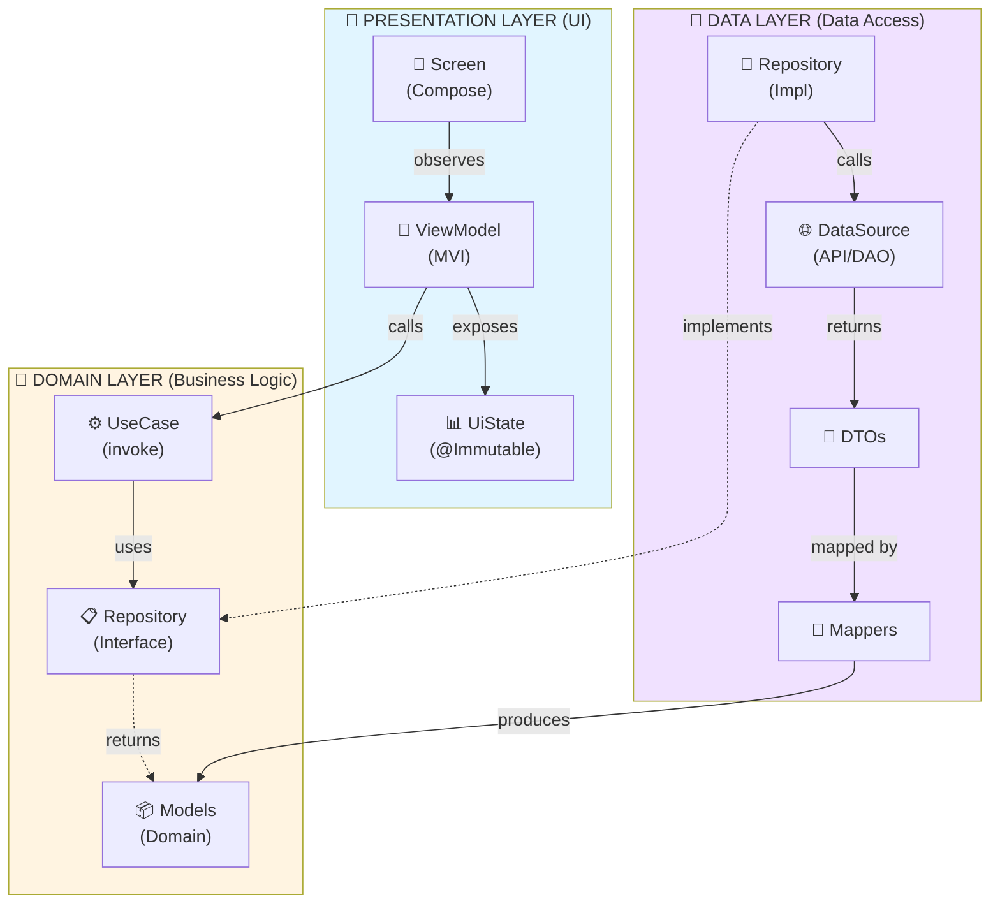
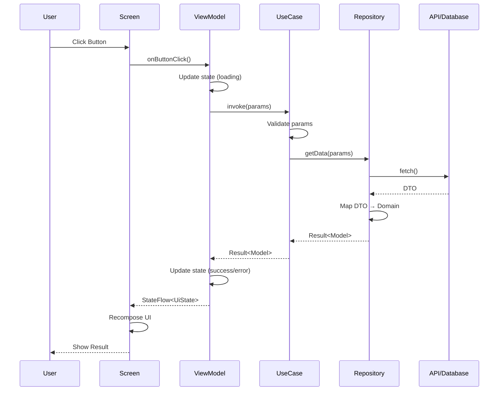

# Architecture & Design Patterns

## Context
A robust architecture ensures scalability, testability, and maintainability. We strictly follow **Clean Architecture** with a clear separation of concerns between Presentation, Domain, and Data layers.

**Related Guides:**
- [04-project-structure.md](./04-project-structure.md) - Package organization
- [07-state-management.md](./07-state-management.md) - ViewModel patterns
- [08-dependency-injection.md](./08-dependency-injection.md) - Hilt/Koin setup

**Code Templates:**
- [UseCaseViewModelExample.kt](../templates/examples/UseCaseViewModelExample.kt) - UseCase + ViewModel pattern
- [UserRepositoryImpl.kt](../templates/examples/UserRepositoryImpl.kt) - Repository implementation

---

## 🎯 AI Quick Reference

```
LAYER RULES:
• Presentation → Domain (NEVER skip to Data)
• Domain → NOTHING (pure Kotlin)
• Data → Domain interfaces only

NAMING:
• Interface: UserRepository (no I prefix)
• Implementation: UserRepositoryImpl
• UseCase: GetUserProfileUseCase (Verb + Noun + UseCase)

DEPENDENCIES:
• ViewModel → UseCase (NEVER Repository directly)
• UseCase → Repository
• Repository → DataSource/API/DAO

SOLID PRINCIPLES:
• S - Single Responsibility: 1 class = 1 reason to change
• O - Open/Closed: Extend via interfaces, not modification
• L - Liskov Substitution: Subtypes replaceable for base types
• I - Interface Segregation: Small, focused interfaces
• D - Dependency Inversion: Depend on abstractions
```

---

## 1. SOLID Principles in Practice

### Single Responsibility (S)
```kotlin
// ❌ WRONG: ViewModel does everything
class UserViewModel : ViewModel() {
    fun loadUser() { /* fetch from API */ }
    fun validateEmail(email: String) { /* validation logic */ }
    fun formatDate(date: Long) { /* formatting logic */ }
    fun saveToDatabase(user: User) { /* DB operation */ }
}

// ✅ CORRECT: Each class has ONE responsibility
class GetUserUseCase(private val repo: UserRepository) {
    suspend operator fun invoke(id: String) = repo.getUser(id)
}

class ValidateEmailUseCase {
    operator fun invoke(email: String): Boolean = email.contains("@")
}

class UserViewModel(
    private val getUser: GetUserUseCase,
    private val validateEmail: ValidateEmailUseCase,
) : ViewModel() { /* orchestrates only */ }
```

### Open/Closed (O)
```kotlin
// ✅ Open for extension, closed for modification
interface PaymentProcessor {
    suspend fun process(amount: Double): Result<PaymentResult>
}

class CreditCardProcessor : PaymentProcessor { /* ... */ }
class PayPalProcessor : PaymentProcessor { /* ... */ }
class CryptoProcessor : PaymentProcessor { /* ... */ }  // NEW - no existing code changed

// Usage: inject any processor
class CheckoutUseCase(private val processor: PaymentProcessor) {
    suspend operator fun invoke(amount: Double) = processor.process(amount)
}
```

### Liskov Substitution (L)
```kotlin
// ✅ Any Repository implementation can replace the interface
interface UserRepository {
    suspend fun getUser(id: String): Result<User>
}

class RemoteUserRepository : UserRepository { /* API calls */ }
class LocalUserRepository : UserRepository { /* Room/DataStore */ }
class FakeUserRepository : UserRepository { /* For testing */ }

// All work interchangeably
val useCase = GetUserUseCase(remoteRepo)  // or localRepo, or fakeRepo
```

### Interface Segregation (I)
```kotlin
// ❌ WRONG: Fat interface
interface UserRepository {
    suspend fun getUser(id: String): User
    suspend fun updateUser(user: User)
    suspend fun deleteUser(id: String)
    suspend fun searchUsers(query: String): List<User>
    suspend fun uploadAvatar(id: String, bytes: ByteArray)
    suspend fun getFollowers(id: String): List<User>
    suspend fun sendNotification(id: String, message: String)
}

// ✅ CORRECT: Segregated interfaces
interface UserReader {
    suspend fun getUser(id: String): User
    suspend fun searchUsers(query: String): List<User>
}

interface UserWriter {
    suspend fun updateUser(user: User)
    suspend fun deleteUser(id: String)
}

interface AvatarManager {
    suspend fun uploadAvatar(id: String, bytes: ByteArray)
}

// Inject only what you need
class GetUserUseCase(private val reader: UserReader)
class UpdateUserUseCase(private val writer: UserWriter)
```

### Dependency Inversion (D)
```kotlin
// ❌ WRONG: High-level depends on low-level
class UserViewModel(
    private val retrofit: Retrofit,           // ❌ Concrete implementation
    private val roomDatabase: AppDatabase,    // ❌ Concrete implementation
)

// ✅ CORRECT: Both depend on abstractions
// Domain layer (high-level) - defines interface
interface UserRepository {
    suspend fun getUser(id: String): Result<User>
}

// Data layer (low-level) - implements interface
class UserRepositoryImpl(
    private val api: UserApi,
    private val dao: UserDao,
) : UserRepository

// Presentation layer - depends on abstraction
class UserViewModel(
    private val getUserUseCase: GetUserUseCase,  // ✅ Abstraction
) : ViewModel()
```

---

## 2. Clean Architecture Layers

### Layer Dependency Diagram



**ASCII Version:**
```
┌─────────────────────────────────────────────────────────┐
│                   PRESENTATION LAYER                     │
│  ┌─────────────┐    ┌─────────────┐    ┌─────────────┐ │
│  │   Screen    │───▶│  ViewModel  │───▶│   UiState   │ │
│  │  (Compose)  │    │    (MVI)    │    │ (Immutable) │ │
│  └─────────────┘    └──────┬──────┘    └─────────────┘ │
│                            │                            │
│                            ▼                            │
├─────────────────────────────────────────────────────────┤
│                     DOMAIN LAYER                        │
│  ┌─────────────┐    ┌─────────────┐    ┌─────────────┐ │
│  │   UseCase   │───▶│  Repository │    │   Models    │ │
│  │  (invoke)   │    │ (Interface) │    │ (Domain)    │ │
│  └─────────────┘    └──────┬──────┘    └─────────────┘ │
│                            │                            │
│                            ▼                            │
├─────────────────────────────────────────────────────────┤
│                      DATA LAYER                         │
│  ┌─────────────┐    ┌─────────────┐    ┌─────────────┐ │
│  │ Repository  │───▶│ DataSource  │───▶│   Mappers   │ │
│  │   (Impl)    │    │ (API/DAO)   │    │ (DTO→Model) │ │
│  └─────────────┘    └─────────────┘    └─────────────┘ │
└─────────────────────────────────────────────────────────┘
```

### Data Flow Sequence



### Layer Responsibilities

| Layer | Contains | Depends On | Android Deps |
|-------|----------|------------|--------------|
| **Presentation** | Screens, ViewModels, UiState | Domain | ✅ Yes |
| **Domain** | UseCases, Repositories (interfaces), Models | Nothing | ❌ NO |
| **Data** | Repository Impl, DataSources, DTOs, Mappers | Domain | ✅ Yes |

### ✅ DO: Correct Layer Separation
```kotlin
// ═══════════════════════════════════════════════════════════
// DOMAIN LAYER - Pure Kotlin, NO Android dependencies
// ═══════════════════════════════════════════════════════════

// domain/model/User.kt
data class User(
    val id: String,
    val name: String,
    val email: String,
)

// domain/repository/UserRepository.kt
interface UserRepository {
    suspend fun getUser(id: String): Result<User>
    fun observeUser(id: String): Flow<User>
}

// domain/usecase/GetUserUseCase.kt
class GetUserUseCase(
    private val userRepository: UserRepository,
) {
    suspend operator fun invoke(userId: String): Result<User> {
        if (userId.isBlank()) {
            return Result.failure(IllegalArgumentException("userId cannot be blank"))
        }
        return userRepository.getUser(userId)
    }
}

// ═══════════════════════════════════════════════════════════
// DATA LAYER - Implements Domain interfaces
// ═══════════════════════════════════════════════════════════

// data/dto/UserDto.kt
@Serializable
data class UserDto(
    @SerialName("user_id") val id: String,
    @SerialName("full_name") val name: String,
    @SerialName("email_address") val email: String,
)

// data/mapper/UserMapper.kt
fun UserDto.toDomain(): User = User(
    id = id,
    name = name,
    email = email,
)

// data/repository/UserRepositoryImpl.kt
class UserRepositoryImpl @Inject constructor(
    private val api: UserApi,
    private val dao: UserDao,
    @IoDispatcher private val dispatcher: CoroutineDispatcher,
) : UserRepository {
    
    override suspend fun getUser(id: String): Result<User> = withContext(dispatcher) {
        try {
            val dto = api.getUser(id)
            dao.insert(dto.toEntity())
            Result.success(dto.toDomain())
        } catch (e: Exception) {
            // Fallback to cache
            dao.getUser(id)?.let { Result.success(it.toDomain()) }
                ?: Result.failure(e.toDomainError())
        }
    }
    
    override fun observeUser(id: String): Flow<User> = 
        dao.observeUser(id).map { it.toDomain() }
}

// ═══════════════════════════════════════════════════════════
// PRESENTATION LAYER - UI + ViewModel
// ═══════════════════════════════════════════════════════════

// presentation/UserViewModel.kt
@HiltViewModel
class UserViewModel @Inject constructor(
    private val getUserUseCase: GetUserUseCase, // ✅ Inject UseCase, NOT Repository
) : ViewModel() {
    
    private val _state = MutableStateFlow(UserUiState())
    val state: StateFlow<UserUiState> = _state.asStateFlow()
    
    fun loadUser(userId: String) {
        viewModelScope.launch {
            _state.update { it.copy(isLoading = true) }
            getUserUseCase(userId)
                .onSuccess { user -> _state.update { it.copy(user = user, isLoading = false) } }
                .onFailure { error -> _state.update { it.copy(error = error.message, isLoading = false) } }
        }
    }
}
```

### ❌ DON'T: Common Architecture Violations
```kotlin
// ❌ BAD: Domain layer with Android dependencies
// domain/usecase/BadUseCase.kt
class BadUseCase(
    private val context: Context, // ❌ Android dependency in Domain!
) {
    suspend operator fun invoke(): String {
        return context.getString(R.string.hello) // ❌ Using Android resources
    }
}

// ❌ BAD: ViewModel directly accessing Repository
@HiltViewModel
class BadViewModel @Inject constructor(
    private val userRepository: UserRepository, // ❌ Should inject UseCase instead
    private val productRepository: ProductRepository, // ❌ Multiple repos = missing UseCase
) : ViewModel()

// ❌ BAD: Repository returning DTOs to Domain
interface BadRepository {
    suspend fun getUser(id: String): UserDto // ❌ Should return domain User
}

// ❌ BAD: Using I prefix for interfaces
interface IUserRepository { } // ❌ Don't use I prefix

// ❌ BAD: Business logic in ViewModel
@HiltViewModel
class BadViewModel @Inject constructor(
    private val api: UserApi, // ❌ Direct API access
) : ViewModel() {
    fun calculateDiscount(price: Double, membership: String): Double {
        // ❌ Business logic should be in UseCase
        return when (membership) {
            "gold" -> price * 0.8
            "silver" -> price * 0.9
            else -> price
        }
    }
}
```

---

## 2. UseCase Pattern

### Rules
- Single public method: `operator fun invoke()`
- Must return `Result<T>` or `Flow<T>`
- Input validation FIRST
- Pure Kotlin (no Context, no Android APIs)
- One UseCase = One business action

### ✅ DO: Proper UseCase Implementation
```kotlin
/**
 * Updates user profile with validation.
 * 
 * @see UserRepository
 */
class UpdateUserProfileUseCase @Inject constructor(
    private val userRepository: UserRepository,
    private val validateEmailUseCase: ValidateEmailUseCase,
) {
    /**
     * Updates user profile.
     * 
     * @param input Profile update data
     * @return Result with updated User or validation/network error
     */
    suspend operator fun invoke(input: UpdateProfileInput): Result<User> {
        // 1. Validate input FIRST
        if (input.name.isBlank()) {
            return Result.failure(ValidationError("Name cannot be blank"))
        }
        
        if (!validateEmailUseCase(input.email)) {
            return Result.failure(ValidationError("Invalid email format"))
        }
        
        if (input.age !in 13..150) {
            return Result.failure(ValidationError("Age must be between 13 and 150"))
        }
        
        // 2. Execute business logic
        return userRepository.updateProfile(input)
    }
}

data class UpdateProfileInput(
    val userId: String,
    val name: String,
    val email: String,
    val age: Int,
)
```

### ✅ DO: UseCase Returning Flow
```kotlin
/**
 * Observes real-time order status changes.
 */
class ObserveOrderStatusUseCase @Inject constructor(
    private val orderRepository: OrderRepository,
) {
    /**
     * @param orderId Order to observe
     * @return Flow of order status updates
     */
    operator fun invoke(orderId: String): Flow<OrderStatus> {
        require(orderId.isNotBlank()) { "orderId cannot be blank" }
        return orderRepository.observeOrderStatus(orderId)
            .distinctUntilChanged()
            .catch { emit(OrderStatus.Unknown) }
    }
}
```

### ✅ DO: UseCase Composing Other UseCases
```kotlin
/**
 * Places an order with full validation and processing.
 */
class PlaceOrderUseCase @Inject constructor(
    private val validateCartUseCase: ValidateCartUseCase,
    private val calculateTotalUseCase: CalculateTotalUseCase,
    private val applyDiscountUseCase: ApplyDiscountUseCase,
    private val orderRepository: OrderRepository,
) {
    suspend operator fun invoke(cart: Cart, couponCode: String?): Result<Order> {
        // Compose multiple use cases
        val validationResult = validateCartUseCase(cart)
        if (validationResult.isFailure) return validationResult.map { Order.EMPTY }
        
        val total = calculateTotalUseCase(cart)
        val finalTotal = couponCode?.let { applyDiscountUseCase(total, it) } ?: total
        
        return orderRepository.createOrder(cart, finalTotal)
    }
}
```

### ❌ DON'T: UseCase Anti-Patterns
```kotlin
// ❌ BAD: Multiple public methods
class BadUseCase {
    suspend fun getUser() { }     // ❌ Multiple methods
    suspend fun updateUser() { }  // ❌ Should be separate UseCases
    suspend fun deleteUser() { }
}

// ❌ BAD: No validation
class BadGetUserUseCase(private val repo: UserRepository) {
    suspend operator fun invoke(userId: String): Result<User> {
        return repo.getUser(userId) // ❌ No input validation!
    }
}

// ❌ BAD: Not returning Result
class BadUseCase(private val repo: UserRepository) {
    suspend operator fun invoke(id: String): User { // ❌ Can throw!
        return repo.getUser(id).getOrThrow()
    }
}

// ❌ BAD: Android dependencies
class BadUseCase(
    private val context: Context, // ❌ NO!
    private val sharedPreferences: SharedPreferences, // ❌ NO!
) {
    operator fun invoke(): String = context.packageName
}
```

---

## 3. Repository Pattern

### Rules
- Interface in Domain layer (pure Kotlin)
- Implementation in Data layer
- Exposes Domain models (not DTOs)
- Handles error mapping
- Manages data sources (local/remote)

### ✅ DO: Offline-First Repository
```kotlin
// domain/repository/ProductRepository.kt
interface ProductRepository {
    suspend fun getProducts(): Result<List<Product>>
    fun observeProducts(): Flow<List<Product>>
    suspend fun refreshProducts(): Result<Unit>
}

// data/repository/ProductRepositoryImpl.kt
class ProductRepositoryImpl @Inject constructor(
    private val api: ProductApi,
    private val dao: ProductDao,
    @IoDispatcher private val dispatcher: CoroutineDispatcher,
) : ProductRepository {
    
    override suspend fun getProducts(): Result<List<Product>> = withContext(dispatcher) {
        try {
            // 1. Try network first
            val response = api.getProducts()
            
            // 2. Cache locally
            dao.insertAll(response.map { it.toEntity() })
            
            // 3. Return domain models
            Result.success(response.map { it.toDomain() })
        } catch (e: Exception) {
            // 4. Fallback to cache on error
            val cached = dao.getAll()
            if (cached.isNotEmpty()) {
                Result.success(cached.map { it.toDomain() })
            } else {
                Result.failure(e.toDomainError())
            }
        }
    }
    
    override fun observeProducts(): Flow<List<Product>> = 
        dao.observeAll()
            .map { entities -> entities.map { it.toDomain() } }
            .flowOn(dispatcher)
    
    override suspend fun refreshProducts(): Result<Unit> = withContext(dispatcher) {
        try {
            val response = api.getProducts()
            dao.deleteAllAndInsert(response.map { it.toEntity() })
            Result.success(Unit)
        } catch (e: Exception) {
            Result.failure(e.toDomainError())
        }
    }
}
```

### ✅ DO: Error Mapping Extension
```kotlin
// data/mapper/ErrorMapper.kt
fun Throwable.toDomainError(): DomainError = when (this) {
    is UnknownHostException -> DomainError.Network.NoConnection
    is SocketTimeoutException -> DomainError.Network.Timeout
    is HttpException -> when (code()) {
        401 -> DomainError.Server.Unauthorized
        403 -> DomainError.Server.Forbidden
        404 -> DomainError.Server.NotFound
        in 500..599 -> DomainError.Server.InternalError
        else -> DomainError.Unknown(message ?: "Unknown error")
    }
    is JsonDecodingException -> DomainError.Data.ParseError(message ?: "Parse error")
    else -> DomainError.Unknown(message ?: "Unknown error")
}

// domain/error/DomainError.kt
sealed interface DomainError {
    sealed interface Network : DomainError {
        data object NoConnection : Network
        data object Timeout : Network
    }
    
    sealed interface Server : DomainError {
        data object Unauthorized : Server
        data object Forbidden : Server
        data object NotFound : Server
        data object InternalError : Server
    }
    
    sealed interface Data : DomainError {
        data class ParseError(val details: String) : Data
    }
    
    data class Unknown(val message: String) : DomainError
}
```

---

## 4. Module Structure

### Recommended Project Structure
```
app/
├── src/main/kotlin/com/example/app/
│   ├── Application.kt
│   ├── MainActivity.kt
│   └── di/
│       └── AppModule.kt
│
core/
├── common/          # Shared utilities
├── network/         # Retrofit, OkHttp setup
├── database/        # Room setup
├── designsystem/    # Theme, Components
└── testing/         # Test utilities
│
feature/
├── user/
│   ├── domain/
│   │   ├── model/User.kt
│   │   ├── repository/UserRepository.kt
│   │   └── usecase/
│   │       ├── GetUserUseCase.kt
│   │       └── UpdateUserUseCase.kt
│   ├── data/
│   │   ├── dto/UserDto.kt
│   │   ├── mapper/UserMapper.kt
│   │   ├── repository/UserRepositoryImpl.kt
│   │   └── di/UserDataModule.kt
│   └── presentation/
│       ├── UserViewModel.kt
│       ├── UserUiState.kt
│       ├── UserScreen.kt
│       └── di/UserPresentationModule.kt
│
├── product/
│   ├── domain/...
│   ├── data/...
│   └── presentation/...
```

---

## 5. Verification Checklist

### Architecture Compliance
- [ ] Domain layer has ZERO Android imports (`import android.*`)
- [ ] ViewModels inject UseCases, NOT Repositories
- [ ] UseCases have single `operator fun invoke()`
- [ ] UseCases return `Result<T>` or `Flow<T>`
- [ ] Repositories return Domain models, NOT DTOs
- [ ] Repository implementations are in Data layer
- [ ] No `I` prefix on interfaces

### Code Quality
- [ ] All public methods have KDoc
- [ ] Input validation happens FIRST in UseCases
- [ ] Errors are mapped to DomainError sealed class
- [ ] Dispatchers are injected (not hardcoded)

---

## 6. Common Mistakes & Fixes

| Mistake | Detection | Fix |
|---------|-----------|-----|
| Android deps in Domain | `import android.*` in domain/ | Move to Data layer or use abstraction |
| ViewModel → Repository | Direct repository injection | Add UseCase between them |
| DTO in Domain | Domain model with `@SerialName` | Separate DTO + Mapper in Data |
| Business logic in ViewModel | Complex calculations in VM | Extract to UseCase |
| No error handling | `getOrThrow()` usage | Return `Result<T>` |
| Hardcoded Dispatchers | `Dispatchers.IO` in class | Inject via `@IoDispatcher` |

