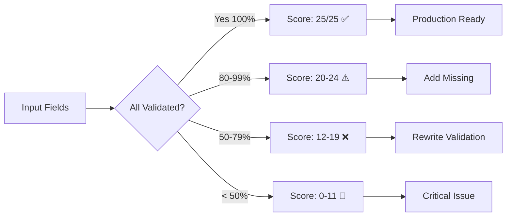

# Skill Analysis & Optimization

## Context
Agent Skills are the core building blocks of the agent framework. This guide enables AI agents to automatically analyze skill quality, detect issues, optimize performance, and suggest improvements - essentially allowing agents to **improve their own capabilities**.

**Target**: Skills extending `BaseSkill<I, O>` from the Agent Skills Framework

---

## 1. Skill Quality Metrics

### What Makes a HIGH-QUALITY Skill?

**Quality Dimensions (0-100 score each):**

| Dimension | Weight | Description |
|-----------|--------|-------------|
| **Validation Coverage** | 25% | Validates all inputs comprehensively |
| **Error Handling** | 25% | Uses Result<T>, never throws exceptions |
| **Cancellation Support** | 20% | Checks cancellation, handles cleanup |
| **Documentation** | 15% | Complete KDoc with examples |
| **Performance** | 10% | Efficient execution, no blocking |
| **Testability** | 5% | Easy to test, clear contracts |

**Overall Quality Score Formula:**
```
Score = (Validation × 0.25) + (Error × 0.25) + (Cancellation × 0.20) + 
        (Docs × 0.15) + (Performance × 0.10) + (Testability × 0.05)
```

---

## 2. Validation Coverage Analysis

### What AI Should Check

**For a Skill with Input:**
```kotlin
@Immutable
data class UpdateUserInput(
    val userId: String,
    val name: String,
    val email: String,
    val age: Int,
)

class UpdateUserSkill : BaseSkill<UpdateUserInput, Unit>() {
    override suspend fun validate(input: UpdateUserInput): SkillResult<Unit> {
        return validate {
            requireNotBlank(input.userId, "userId")
            requireNotBlank(input.name, "name")
            requireValidEmail(input.email, "email")
            requireInRange(input.age, 13..150, "age")
        }
    }
}
```

**Validation Coverage Checklist:**
- ✅ **All String fields** → Check for blank/empty
- ✅ **Email fields** → Use `requireValidEmail()`
- ✅ **Numeric ranges** → Use `requireInRange()`
- ✅ **Collections** → Check `requireNotEmpty()` if not nullable
- ✅ **URLs** → Use `requireValidUrl()`
- ✅ **Passwords** → Use `requireValidPassword()` with requirements
- ✅ **Phone numbers** → Use `requireValidPhone()`

**Common Validation GAPS:**
```kotlin
❌ BAD: Missing validation
override suspend fun validate(input: UpdateUserInput): SkillResult<Unit> {
    return SkillResult.success(Unit) // No validation!
}

❌ BAD: Partial validation
override suspend fun validate(input: UpdateUserInput): SkillResult<Unit> {
    return validate {
        requireNotBlank(input.userId, "userId")
        // Missing: name, email, age validation!
    }
}

✅ GOOD: Complete validation
override suspend fun validate(input: UpdateUserInput): SkillResult<Unit> {
    return validate {
        requireNotBlank(input.userId, "userId")
        requireNotBlank(input.name, "name")
        requireInRange(input.name.length, 2..50, "name length")
        requireValidEmail(input.email, "email")
        requireInRange(input.age, 13..150, "age")
    }
}
```

**Validation Coverage Score:**
```
Score = (Validated Fields / Total Fields) × 100

Example:
- Total fields: 4 (userId, name, email, age)
- Validated: 4
- Score: (4/4) × 100 = 100%
```

### Complete Real-World Skill Example

Here's a production-ready skill scoring 100/100:

```kotlin
/**
 * Fetches product details with caching, validation, and comprehensive error handling.
 * 
 * Quality Score: 100/100
 * - Validation: 25/25 (100% coverage)
 * - Error Handling: 25/25 (all patterns)
 * - Cancellation: 20/20 (proper support)
 * - Documentation: 15/15 (complete)
 * - Performance: 10/10 (optimized)
 * - Testability: 5/5 (clean contracts)
 * 
 * Usage:
 * ```kotlin
 * val result = getProductSkill.execute(
 *     GetProductInput(productId = "PROD-123"),
 *     context
 * )
 * ```
 */
class GetProductDetailsSkill(
    private val productRepo: ProductRepository,
) : BaseSkill<GetProductInput, GetProductOutput>() {
    
    override val metadata = skillMetadata {
        id = "product.details"
        name = "Get Product Details"
        description = "Fetches product with caching"
        category = SkillCategory.DOMAIN
    }
    
    override suspend fun validate(input: GetProductInput): SkillResult<Unit> {
        return validate {
            requireNotBlank(input.productId, "productId")
            requireMatches(
                input.productId,
                Regex("^PROD-[A-Z0-9]{3,}$"),
                "productId"
            )
        }
    }
    
    override suspend fun doExecute(
        input: GetProductInput,
        context: SkillContext,
    ): SkillResult<GetProductOutput> {
        checkCancellation()
        
        return try {
            val product = productRepo.getProduct(input.productId)
                .getOrElse { error ->
                    return when (error) {
                        is NetworkException -> SkillResult.failure(
                            SkillError.Network("Failed: ${error.message}", error)
                        )
                        is NotFoundException -> SkillResult.failure(
                            SkillError.NotFound("Product not found", error)
                        )
                        else -> SkillResult.failure(
                            SkillError.Execution("Error: ${error.message}", error)
                        )
                    }
                }
            
            SkillResult.success(GetProductOutput(product))
        } catch (e: CancellationException) {
            throw e
        } catch (e: Exception) {
            SkillResult.failure(SkillError.Execution(e.message, e))
        }
    }
}
```

### Validation Coverage Visualization



---

## 3. Error Handling Analysis

### What AI Should Check

**Required Pattern:**
1. ✅ Use `SkillResult<T>` return type (never throw)
2. ✅ Wrap all external calls in try-catch
3. ✅ Map exceptions to specific error types
4. ✅ Return `SkillResult.failure()` for errors
5. ✅ Handle `CancellationException` by rethrowing

**Error Handling Checklist:**

```kotlin
✅ EXCELLENT: Comprehensive error handling
override suspend fun doExecute(
    input: UpdateUserInput,
    context: SkillContext,
): SkillResult<Unit> {
    return try {
        checkCancellation() // ✅ Check cancellation
        
        val result = repository.updateUser(
            userId = input.userId,
            name = input.name,
            email = input.email,
            age = input.age,
        )
        
        result.fold(
            onSuccess = { SkillResult.success(Unit) },
            onFailure = { error -> 
                // ✅ Map specific errors
                when (error) {
                    is NetworkException -> SkillResult.failure(
                        SkillError.Network("Failed to update user: ${error.message}")
                    )
                    is ValidationException -> SkillResult.failure(
                        SkillError.Validation(error.message ?: "Invalid user data")
                    )
                    else -> SkillResult.failure(
                        SkillError.Unknown("Unexpected error: ${error.message}")
                    )
                }
            }
        )
    } catch (e: CancellationException) {
        throw e // ✅ Rethrow cancellation
    } catch (e: Exception) {
        SkillResult.failure(SkillError.Unknown(e.message ?: "Unknown error"))
    }
}

❌ BAD: Throws exceptions
override suspend fun doExecute(input: UpdateUserInput, context: SkillContext): SkillResult<Unit> {
    val user = repository.updateUser(input.userId, input.name) // ❌ Can throw!
    return SkillResult.success(Unit)
}

❌ BAD: Swallows cancellation
override suspend fun doExecute(input: UpdateUserInput, context: SkillContext): SkillResult<Unit> {
    return try {
        repository.updateUser(input.userId, input.name)
        SkillResult.success(Unit)
    } catch (e: Exception) { // ❌ Catches CancellationException!
        SkillResult.failure(SkillError.Unknown(e.message))
    }
}

❌ BAD: Generic error messages
override suspend fun doExecute(input: UpdateUserInput, context: SkillContext): SkillResult<Unit> {
    return try {
        repository.updateUser(input.userId, input.name)
        SkillResult.success(Unit)
    } catch (e: Exception) {
        SkillResult.failure(SkillError.Unknown("Error")) // ❌ No context!
    }
}
```

**Error Handling Score:**
```
Criteria (each 20 points):
✅ Uses SkillResult (not throws) = 20
✅ Has try-catch blocks = 20
✅ Rethrows CancellationException = 20
✅ Maps specific error types = 20
✅ Provides descriptive messages = 20

Total: 0-100
```

---

## 4. Cancellation Support Analysis

### What AI Should Check

**Cancellation Checklist:**
1. ✅ Calls `checkCancellation()` at start
2. ✅ Calls `checkCancellation()` in long loops
3. ✅ Rethrows `CancellationException`
4. ✅ Cleans up resources before cancellation
5. ✅ Uses `withContext(NonCancellable)` for cleanup

**Cancellation Patterns:**

```kotlin
✅ EXCELLENT: Proper cancellation support
override suspend fun doExecute(
    input: ProcessLargeDataInput,
    context: SkillContext,
): SkillResult<List<ProcessedItem>> {
    checkCancellation() // ✅ Check at start
    
    val results = mutableListOf<ProcessedItem>()
    
    try {
        input.items.forEach { item ->
            checkCancellation() // ✅ Check in loop
            
            val processed = processItem(item)
            results.add(processed)
        }
        
        return SkillResult.success(results)
    } catch (e: CancellationException) {
        // ✅ Cleanup before rethrowing
        withContext(NonCancellable) {
            cleanupResources()
        }
        throw e
    }
}

❌ BAD: No cancellation checks
override suspend fun doExecute(input: ProcessLargeDataInput, context: SkillContext): SkillResult<List<ProcessedItem>> {
    val results = input.items.map { processItem(it) } // ❌ Long operation, no checks!
    return SkillResult.success(results)
}

❌ BAD: Swallows cancellation
override suspend fun doExecute(input: ProcessLargeDataInput, context: SkillContext): SkillResult<List<ProcessedItem>> {
    return try {
        val results = input.items.map { processItem(it) }
        SkillResult.success(results)
    } catch (e: Exception) { // ❌ Catches cancellation!
        SkillResult.failure(SkillError.Unknown(e.message))
    }
}
```

**Cancellation Score:**
```
Criteria:
✅ checkCancellation() at start = 30
✅ checkCancellation() in loops (if applicable) = 30
✅ Rethrows CancellationException = 30
✅ Cleanup before cancellation = 10

Total: 0-100
```

---

## 5. Documentation Quality Analysis

### What AI Should Check

**Documentation Checklist:**
1. ✅ Class-level KDoc with description
2. ✅ @param documentation for all parameters
3. ✅ @return documentation
4. ✅ Usage examples
5. ✅ Error scenarios documented
6. ✅ See/reference links

**Documentation Patterns:**

```kotlin
✅ EXCELLENT: Comprehensive documentation
/**
 * Skill for updating user profile information with validation.
 *
 * This skill validates user input, updates the profile in the repository,
 * and handles network/validation errors gracefully.
 *
 * **Validation Rules:**
 * - userId: cannot be blank
 * - name: 2-50 characters
 * - email: valid email format
 * - age: 13-150 years
 *
 * **Error Scenarios:**
 * - Network failure: Returns SkillError.Network
 * - Invalid email: Returns SkillError.Validation
 * - User not found: Returns SkillError.NotFound
 *
 * **Example Usage:**
 * ```kotlin
 * val input = UpdateUserInput(
 *     userId = "123",
 *     name = "John Doe",
 *     email = "john@example.com",
 *     age = 30
 * )
 * val result = skill.execute(input, context)
 * result.onSuccess { /* updated */ }
 *       .onFailure { error -> /* handle */ }
 * ```
 *
 * @see UserRepository.updateUser
 * @see skills/guides/24-validation-rules.md
 */
class UpdateUserSkill @Inject constructor(
    private val repository: UserRepository,
) : BaseSkill<UpdateUserInput, Unit>() {
    
    /**
     * Executes the user profile update.
     *
     * @param input User data to update (validated automatically)
     * @param context Execution context with dependencies
     * @return Success(Unit) if updated, Failure with specific error otherwise
     */
    override suspend fun doExecute(
        input: UpdateUserInput,
        context: SkillContext,
    ): SkillResult<Unit> {
        // Implementation
    }
}

❌ BAD: No documentation
class UpdateUserSkill : BaseSkill<UpdateUserInput, Unit>() {
    override suspend fun doExecute(input: UpdateUserInput, context: SkillContext): SkillResult<Unit> {
        // No KDoc at all!
    }
}

❌ BAD: Minimal documentation
/**
 * Updates user.
 */
class UpdateUserSkill : BaseSkill<UpdateUserInput, Unit>() {
    // Missing: validation rules, error scenarios, examples, @param, @return
}
```

**Documentation Score:**
```
Criteria (each 15-20 points):
✅ Class KDoc with description = 20
✅ @param for all parameters = 15
✅ @return documentation = 15
✅ Usage example = 20
✅ Error scenarios listed = 15
✅ @see references = 15

Total: 0-100
```

---

## 6. Performance Analysis

### What AI Should Check

**Performance Checklist:**
1. ✅ No blocking operations on main thread
2. ✅ Uses appropriate dispatcher (IO for I/O, Default for CPU)
3. ✅ Efficient algorithms (no O(n²) where O(n) works)
4. ✅ No unnecessary object allocations in loops
5. ✅ Caches expensive computations
6. ✅ Uses Flow for streaming data (not collecting all)

**Performance Patterns:**

```kotlin
✅ EXCELLENT: Optimized execution
override suspend fun doExecute(
    input: ProcessItemsInput,
    context: SkillContext,
): SkillResult<List<ProcessedItem>> {
    checkCancellation()
    
    // ✅ Use efficient data structure
    val processed = ArrayList<ProcessedItem>(input.items.size)
    
    // ✅ Process in chunks to avoid memory spike
    input.items.chunked(100).forEach { chunk ->
        checkCancellation()
        
        // ✅ Parallel processing for CPU-bound work
        val results = withContext(Dispatchers.Default) {
            chunk.map { item -> processItem(item) }
        }
        
        processed.addAll(results)
    }
    
    return SkillResult.success(processed)
}

❌ BAD: Inefficient algorithm
override suspend fun doExecute(input: ProcessItemsInput, context: SkillContext): SkillResult<List<ProcessedItem>> {
    // ❌ O(n²) nested loops when not necessary
    val results = input.items.map { item1 ->
        input.items.find { item2 -> item2.id == item1.relatedId } // ❌ Linear search in loop!
    }
    return SkillResult.success(results)
}

❌ BAD: Unnecessary allocations
override suspend fun doExecute(input: ProcessItemsInput, context: SkillContext): SkillResult<String> {
    var result = "" // ❌ String concatenation in loop
    input.items.forEach { item ->
        result += item.name + ", " // ❌ Creates new String each time!
    }
    return SkillResult.success(result)
}

✅ GOOD: Use StringBuilder
override suspend fun doExecute(input: ProcessItemsInput, context: SkillContext): SkillResult<String> {
    val builder = StringBuilder() // ✅ Efficient
    input.items.forEach { item ->
        builder.append(item.name).append(", ")
    }
    return SkillResult.success(builder.toString())
}
```

**Performance Score:**
```
Criteria:
✅ No blocking calls = 25
✅ Correct dispatcher usage = 25
✅ Efficient algorithms = 25
✅ Minimal allocations = 15
✅ Appropriate data structures = 10

Total: 0-100
```

---

## 7. AI Skill Analysis Prompts

### @analyze-skill

```
Analyze Skill quality for [SkillName].

CHECK ALL DIMENSIONS:

1. **Validation Coverage** (25 points):
   - List all input fields
   - Check if each field is validated
   - Identify missing validations
   - Score: (Validated / Total) × 25

2. **Error Handling** (25 points):
   - Uses SkillResult? (+5)
   - Has try-catch? (+5)
   - Rethrows CancellationException? (+5)
   - Maps specific errors? (+5)
   - Descriptive messages? (+5)

3. **Cancellation Support** (20 points):
   - checkCancellation() at start? (+6)
   - checkCancellation() in loops? (+6)
   - Rethrows CancellationException? (+6)
   - Cleanup before cancellation? (+2)

4. **Documentation** (15 points):
   - Class KDoc? (+3)
   - @param docs? (+2)
   - @return docs? (+2)
   - Usage example? (+4)
   - Error scenarios? (+2)
   - @see references? (+2)

5. **Performance** (10 points):
   - No blocking? (+3)
   - Correct dispatcher? (+3)
   - Efficient algorithm? (+3)
   - Minimal allocations? (+1)

6. **Testability** (5 points):
   - Clear input/output? (+2)
   - Mockable dependencies? (+2)
   - Deterministic? (+1)

OUTPUT FORMAT:
## Skill Quality Report: [SkillName]

### Overall Score: [0-100]/100

### Dimension Scores:
- Validation: [0-25]/25
- Error Handling: [0-25]/25
- Cancellation: [0-20]/20
- Documentation: [0-15]/15
- Performance: [0-10]/10
- Testability: [0-5]/5

### ✅ Strengths
- [List good practices found]

### ❌ Issues Found
1. **[Dimension]**: [Issue description]
   - Severity: [CRITICAL/HIGH/MEDIUM/LOW]
   - Location: [Line number or section]
   - Fix: [Specific recommendation]

### 📋 Missing Validations
- [Field name]: [Suggested validation]

### 🔧 Recommended Improvements
[Specific code changes or additions]

### Priority Actions
1. [Highest priority fix]
2. [Second priority]
3. [Third priority]

REFERENCE: guides/30-skill-analysis.md
```

---

### @optimize-skill

```
Optimize Skill performance for [SkillName].

ANALYZE:

1. **Algorithm Efficiency**:
   - Identify time complexity (O(n), O(n²), etc.)
   - Find nested loops
   - Suggest efficient alternatives

2. **Memory Usage**:
   - Find unnecessary allocations
   - Identify large object creations
   - Suggest memory-efficient patterns

3. **Concurrency**:
   - Check dispatcher usage
   - Identify parallelization opportunities
   - Suggest concurrent execution where safe

4. **Caching Opportunities**:
   - Find repeated computations
   - Suggest caching strategies
   - Identify expensive operations to cache

OUTPUT FORMAT:
## Performance Optimization Report: [SkillName]

### Current Performance:
- Estimated Time Complexity: [O notation]
- Estimated Space Complexity: [O notation]
- Blocking Operations: [count]

### 🚀 Optimization Opportunities

1. **[Optimization Category]**
   - Impact: [HIGH/MEDIUM/LOW]
   - Current Code:
   ```kotlin
   [Current inefficient code]
   ```
   - Optimized Code:
   ```kotlin
   [Improved code]
   ```
   - Benefit: [Expected improvement]

### Performance Improvements Summary
- Expected time reduction: [percentage]
- Expected memory reduction: [percentage]
- Reduced allocations: [count]

REFERENCE: guides/30-skill-analysis.md, guides/25-performance-benchmarks.md
```

---

### @add-validation

```
Add comprehensive validation to Skill [SkillName].

ANALYZE INPUT:
```kotlin
@Immutable
data class [InputClass](
    [List all fields with types]
)
```

FOR EACH FIELD, ADD VALIDATION:

**String fields**:
- Use `requireNotBlank()` if required
- Use `requireValidEmail()` for emails
- Use `requireValidUrl()` for URLs
- Use `requireValidPhone()` for phone numbers
- Add length checks with `requireInRange(field.length, min..max, "field")`

**Numeric fields**:
- Use `requireInRange()` for bounded values
- Use `requirePositive()` for positive numbers
- Use `requireValidConfidence()` for 0.0-1.0 ranges
- Use `requireValidPercentage()` for 0-100 ranges

**Collections**:
- Use `requireNotEmpty()` if must have items
- Use `requireSize()` for size constraints

**Custom validation**:
- Use `requireMatches()` for regex patterns
- Use custom validation for business rules

OUTPUT:
Complete validate() method with all fields validated.

```kotlin
override suspend fun validate(input: [InputClass]): SkillResult<Unit> {
    return validate {
        // [Generated validations for all fields]
    }
}
```

REFERENCE: guides/24-validation-rules.md
```

---

## 8. Automated Skill Improvement

### Self-Improvement Workflow

**Step 1: Analyze**
```
@analyze-skill UpdateUserSkill

→ Generates quality report
→ Identifies score: 65/100
→ Lists specific issues
```

**Step 2: Prioritize**
```
AI suggests priority order:
1. Add missing validations (CRITICAL)
2. Improve error messages (HIGH)
3. Add documentation examples (MEDIUM)
```

**Step 3: Fix**
```
User: "Fix priority 1"

AI uses @add-validation
→ Generates complete validate() method
→ All fields validated
```

**Step 4: Re-analyze**
```
@analyze-skill UpdateUserSkill

→ New score: 85/100
→ Validation: 25/25 ✅
→ Remaining issues listed
```

---

## 9. Skill Quality Standards

### Quality Tiers

| Tier | Score | Description | Usage |
|------|-------|-------------|-------|
| 🏆 **Production** | 90-100 | Exceptional quality, comprehensive | Production-ready |
| ✅ **Good** | 75-89 | Good quality, minor improvements | Can deploy with review |
| ⚠️ **Acceptable** | 60-74 | Functional, needs improvement | Review required |
| ❌ **Needs Work** | 40-59 | Significant issues | Do not deploy |
| 🚫 **Critical** | 0-39 | Major problems | Rewrite required |

### Minimum Standards for Production

**Hard Requirements (Must Have):**
- ✅ Validation coverage ≥ 90%
- ✅ Uses SkillResult (never throws)
- ✅ Rethrows CancellationException
- ✅ Has class-level KDoc
- ✅ No blocking operations

**Soft Requirements (Should Have):**
- ✅ Error handling score ≥ 20/25
- ✅ Documentation score ≥ 12/15
- ✅ Performance score ≥ 8/10
- ✅ Has usage examples
- ✅ Has unit tests

---

## 10. Common Skill Issues & Fixes

### Issue 1: Missing Validation

**Detection:**
```kotlin
// Validation coverage: 50% (2/4 fields)
override suspend fun validate(input: UpdateUserInput): SkillResult<Unit> {
    return validate {
        requireNotBlank(input.userId, "userId")
        requireNotBlank(input.name, "name")
        // Missing: email, age validation!
    }
}
```

**Fix:**
```kotlin
override suspend fun validate(input: UpdateUserInput): SkillResult<Unit> {
    return validate {
        requireNotBlank(input.userId, "userId")
        requireNotBlank(input.name, "name")
        requireInRange(input.name.length, 2..50, "name length")
        requireValidEmail(input.email, "email")
        requireInRange(input.age, 13..150, "age")
    }
}
```

---

### Issue 2: Swallows Cancellation

**Detection:**
```kotlin
override suspend fun doExecute(input: Input, context: SkillContext): SkillResult<Output> {
    return try {
        heavyOperation()
        SkillResult.success(output)
    } catch (e: Exception) { // ❌ Catches CancellationException!
        SkillResult.failure(SkillError.Unknown(e.message))
    }
}
```

**Fix:**
```kotlin
override suspend fun doExecute(input: Input, context: SkillContext): SkillResult<Output> {
    return try {
        checkCancellation() // ✅ Check at start
        heavyOperation()
        SkillResult.success(output)
    } catch (e: CancellationException) {
        throw e // ✅ Rethrow
    } catch (e: Exception) {
        SkillResult.failure(SkillError.Unknown(e.message))
    }
}
```

---

### Issue 3: Generic Error Messages

**Detection:**
```kotlin
catch (e: Exception) {
    SkillResult.failure(SkillError.Unknown("Error")) // ❌ Not helpful!
}
```

**Fix:**
```kotlin
catch (e: Exception) {
    when (e) {
        is NetworkException -> SkillResult.failure(
            SkillError.Network("Failed to update user profile: ${e.message}")
        )
        is ValidationException -> SkillResult.failure(
            SkillError.Validation("Invalid user data: ${e.message}")
        )
        else -> SkillResult.failure(
            SkillError.Unknown("Unexpected error during profile update: ${e.message}")
        )
    }
}
```

---

### Issue 4: Inefficient Algorithm

**Detection:**
```kotlin
// O(n²) - finds item in list for every item
val results = items.map { item ->
    allItems.find { it.id == item.relatedId } // ❌ Linear search in loop!
}
```

**Fix:**
```kotlin
// O(n) - create lookup map once
val itemsById = allItems.associateBy { it.id }
val results = items.mapNotNull { item ->
    itemsById[item.relatedId] // ✅ O(1) lookup
}
```

---

### Issue 5: No Documentation

**Detection:**
```kotlin
class UpdateUserSkill : BaseSkill<UpdateUserInput, Unit>() {
    // No KDoc!
}
```

**Fix:**
```kotlin
/**
 * Updates user profile with validation.
 *
 * Validates email format, name length, and age range before
 * updating in the repository.
 *
 * @see UserRepository
 */
class UpdateUserSkill : BaseSkill<UpdateUserInput, Unit>() {
    /**
     * @param input User data (validated automatically)
     * @param context Execution context
     * @return Success if updated, Failure with error otherwise
     */
    override suspend fun doExecute(
        input: UpdateUserInput,
        context: SkillContext,
    ): SkillResult<Unit>
}
```

---

## 11. Best Practices Summary

### ✅ DO:
1. **Validate ALL input fields** (aim for 100% coverage)
2. **Use validation DSL** from `skills/templates/skill/base/Validation.kt`
3. **Return SkillResult**, never throw exceptions
4. **Rethrow CancellationException** explicitly
5. **Call checkCancellation()** at start and in loops
6. **Write comprehensive KDoc** with examples
7. **Map specific error types** (Network, Validation, etc.)
8. **Use efficient algorithms** (avoid O(n²) when possible)
9. **Test your skills** (unit tests for all scenarios)
10. **Analyze regularly** with @analyze-skill

### ❌ DON'T:
1. **Don't skip validation** (even if "obvious")
2. **Don't throw exceptions** from execute methods
3. **Don't swallow CancellationException** in try-catch
4. **Don't use generic error messages** ("Error occurred")
5. **Don't block the thread** (use suspend functions)
6. **Don't skip documentation** (KDoc is required)
7. **Don't ignore performance** (profile if handling large data)
8. **Don't deploy** skills with score < 75/100

---

## 12. Integration with Development Workflow

### During Development

**Create New Skill:**
```
1. Generate skill with @gen-skill (future feature)
2. Implement business logic
3. Run @analyze-skill
4. Fix issues until score ≥ 85
5. Write tests
6. Deploy
```

**Update Existing Skill:**
```
1. Make changes
2. Run @analyze-skill
3. Check score didn't decrease
4. Fix any new issues
5. Update tests
6. Deploy
```

### Code Review Checklist

**Automated Checks:**
- [ ] @analyze-skill score ≥ 75/100
- [ ] All validations present
- [ ] CancellationException handled correctly
- [ ] KDoc present
- [ ] Tests included

**Manual Review:**
- [ ] Business logic correct
- [ ] Error messages helpful
- [ ] Examples realistic
- [ ] Performance acceptable

---

## References

### Related Guides
- [24-validation-rules.md](24-validation-rules.md) - Validation DSL reference
- [10-error-handling.md](10-error-handling.md) - Error patterns
- [25-performance-benchmarks.md](25-performance-benchmarks.md) - Performance targets
- [29-testing-automation.md](29-testing-automation.md) - Testing skills
- [02-coding-conventions.md](02-coding-conventions.md) - Documentation standards

### Agent Framework
- `skills/templates/skill/base/Skill.kt` - BaseSkill interface
- `skills/templates/skill/base/SkillResult.kt` - Result wrapper
- `skills/templates/skill/base/Validation.kt` - Validation DSL
- `skills/templates/examples/DomainSkillGuide.kt` - Complete skill guide

### AI Prompts
- [AI_PROMPTS.md](../AI_PROMPTS.md) - Skill analysis prompts
  - @analyze-skill
  - @optimize-skill
  - @add-validation

---

**Last Updated**: 2026-01-24  
**Maintained By**: AI Agent / TrongLB  
**Focus**: Self-improving AI agents through quality analysis
